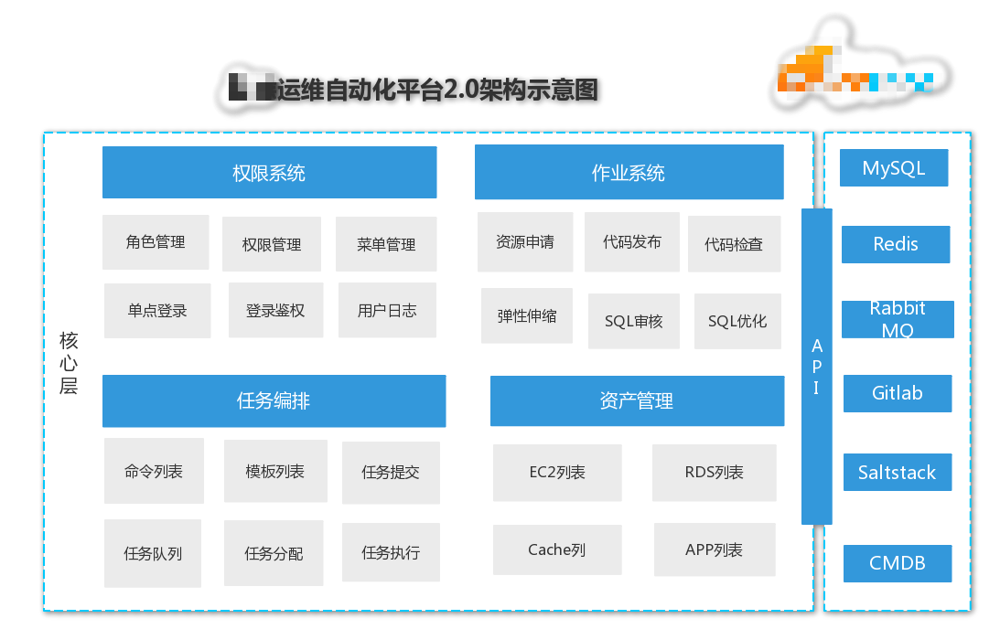
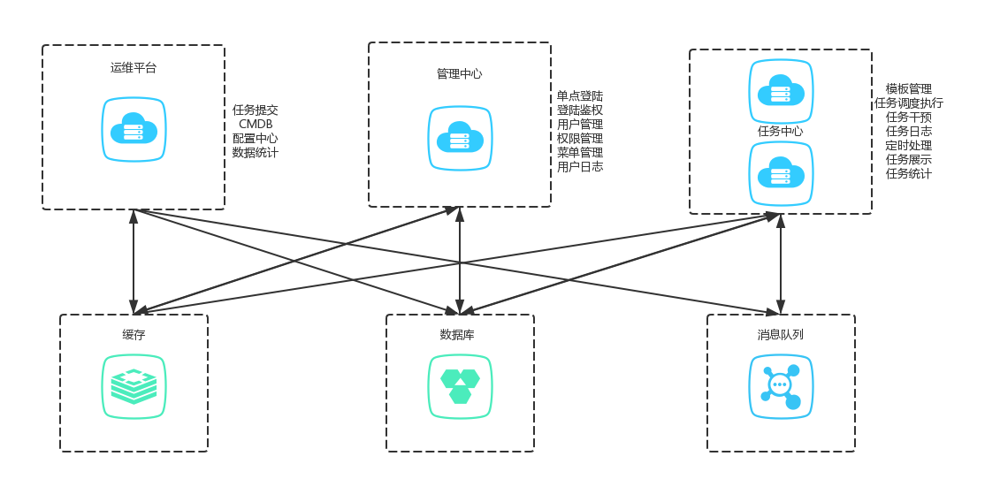
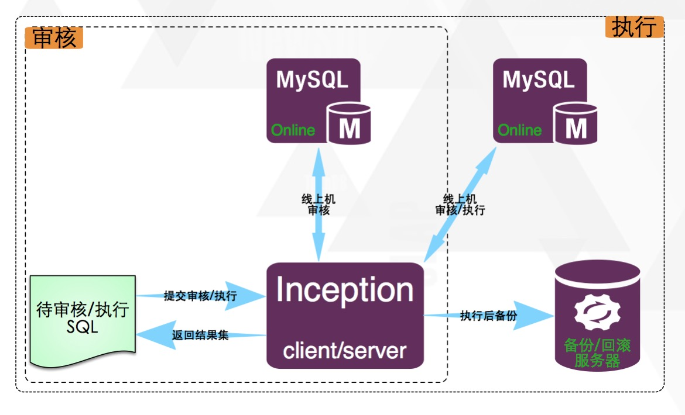
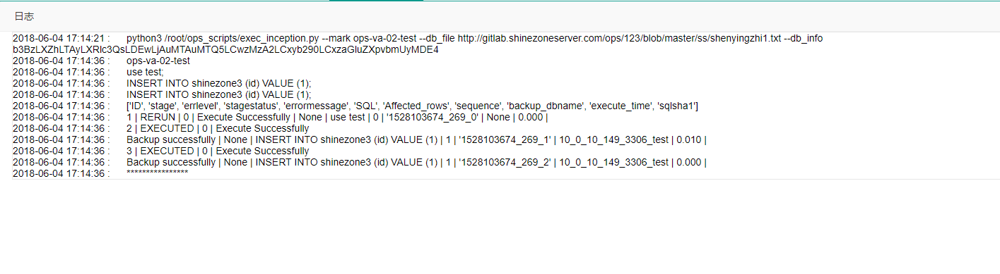
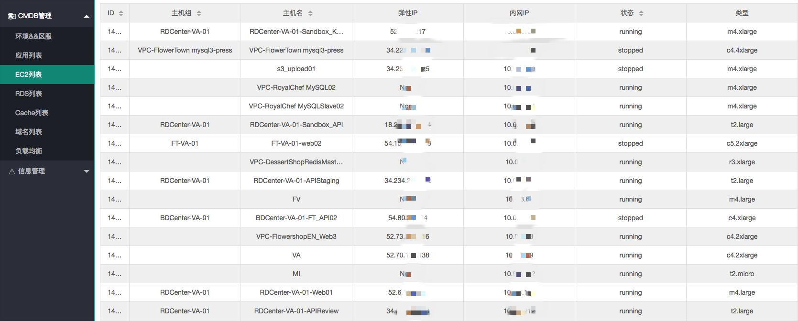
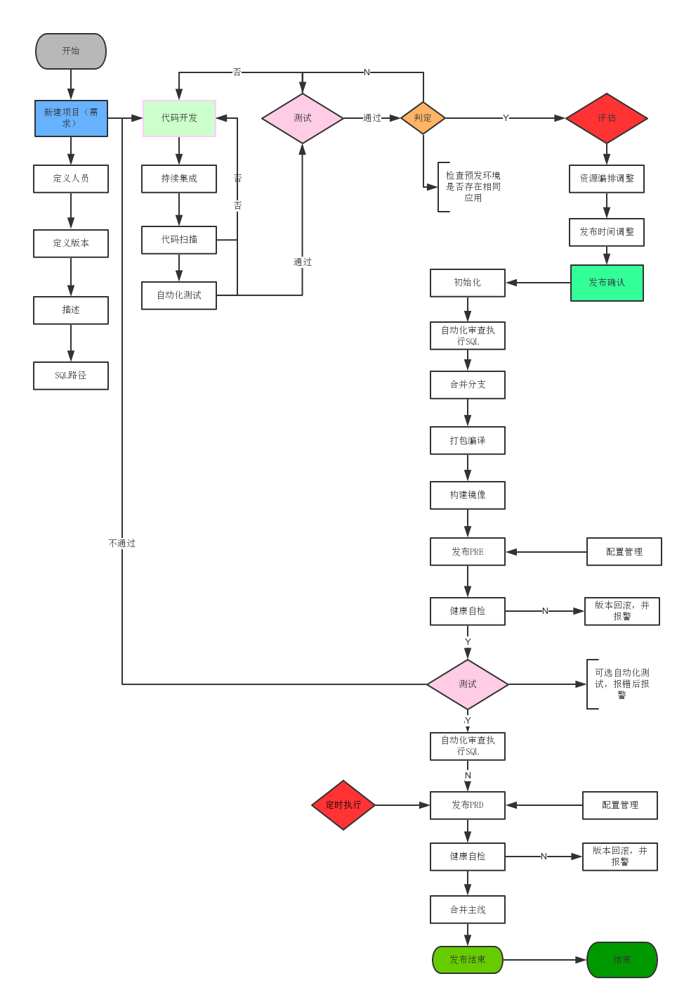

### 一、运维自动化平台2.0概述

#### 1.1 运维自动化平台架构图

#### 1.2 运维自动化平台功能组件概述

- 权限系统

  用户登录，及用户角色的权限分配

  统一权限认证接口

  操作日志记录

- 任务编排

  自定义任务模板

  任务可接手，可重做

- 作业平台

  资源申请(AWS,阿里云,腾讯)

  自动化部署

  代码发布，代码扫描

  SQL优化、审核、执行

  自动弹性伸缩
  

- 资产管理

  云主机资产管理

  数据库信息

  缓存信息

  区服APP信息

  
- 微服务架构容器化

### 二、权限系统

#### 2.1 用户角色的权限分配

权限控制原理：

​     a、用户登录，获取当前用户所在角色的所有权限(url+action)，并写入缓存

​	  b、请求具体API URL或者菜单时，在缓存中获取该用户的权限，并进行匹配

#### 2.2 统一权限认证接口

接口认证原理：

​	a、用户登录成功后，生成一串加密的key，有效期默认1天，并写入缓存

​	b、用户请求URL时，服务端解密key，校验用户是否匹配，是否过期

​	c、校验成功，则通过访问；否则跳转到登录接口，重新登录认证

###  三、任务编排

#### 3.1 自定义任务模板

每个模板都可自定义命令列表，可单独设置每条命令出发条件及参数

#### 3.2 任务操作

任务可接手，接手后开始执行

任务可重做，可终止

任务详情日志可查看

### 四、作业平台

#### 4.1 资源申请(AWS,阿里云,腾讯)

1、运营或项目组自助申请服务器                      

 2、填写相关信息                                               

3、审核流程完毕                                               

4、自动购买主机及服务部署

#### 4.2 自动化部署

1、自定义实例类型,所需要部署的服务

2、批量购买EC2,RDS,REDIS等云服务

3、批量部署所需要的服务

4、统一进行智能调优（系统、服务）

5、自动关联及配置LB   

6、自动配置游戏域名及域名解析

7、自动接入报警监控系统

8、自动接入日志系统

#### 4.3自动化发布

**1、开发人员按照规范打Tag**

测试服-Tag:  qa-ft-20180621_01

预发布服-Tag:staging-ft-20180621_0

审核服-Tag:    review-ft-20180621_01

正式服-Tag:    release-ft-20180621_01

**2、发布系统根据Tag来发布到相对应的服务器**

   如release-ft,则表示把该tag的代码发布到FT正式服

#### 4.4自动化扩容

**1、监控系统监控web负载                                 **

**2、根据负载指标来触发相应扩/缩容任务          **

**3、根据线上配置来部署相同服务及代码**

#### 4.5 自动化代码检查

#### 4.6 SQL优化

SQLAdvisor 是由美团点评公司北京DBA团队开发维护的 SQL 优化工具：输入SQL，输出索引优化建议。 它基于 MySQL 原生词法解析，再结合 SQL 中的 where 条件以及字段选择度、聚合条件、多表 Join 关系等最终输出最优的索引优化建议。目前 SQLAdvisor 在公司内部大量使用，较为成熟、稳定。

**使用SQLAdvisor 结合CMDB，把SQL优化接入运维自动化平台，方便直接在运维平台使用，简单易操作**

#### 4.7 SQL审核

**使用inception 结合CMDB，把SQL审核接入运维自动化平台，方便直接在运维平台使用，拥有审计，审核，执行，备份功能，并且可以结合代码发布使用。（不支持项目应用内置分库分表逻辑的DML）**

### 五、资产管理

### 六、微服务架构容器化

